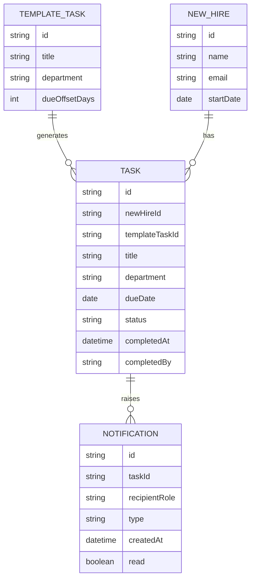

# Domain Model

The tracker centers on a new hire's checklist: tasks are generated from a
shared template, each owned by one department, and notifications record
reminders and escalations raised when a task runs overdue.

- **TEMPLATE\_TASK** — the standard checklist: one task definition per
department with a due-date offset from the start date, maintained by the
HR Coordinator.
- **NEW\_HIRE** — a person being onboarded; adding one generates their `TASK`s
from the current template.
- **TASK** — one checklist item for one new hire; `department` is `IT`, `HR`
or `Facilities`; `status` is `pending`, `completed` or `overdue`.
- **NOTIFICATION** — an in-app reminder (to the owning department) or
escalation (to the HR Coordinator) raised when a `TASK` becomes overdue.

