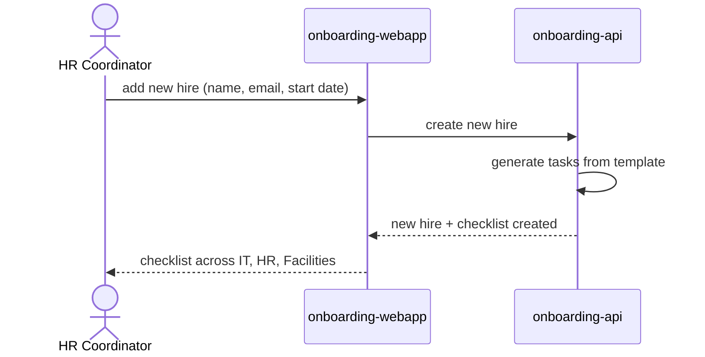

# Add a new hire

The HR Coordinator adds a new hire and the system generates their onboarding
checklist across IT, HR and Facilities from the shared template.

```mermaid
sequenceDiagram
    actor HRCoordinator as HR Coordinator
    participant onboarding-webapp
    participant onboarding-api

    HRCoordinator->>onboarding-webapp: add new hire (name, email, start date)
    onboarding-webapp->>onboarding-api: create new hire
    onboarding-api->>onboarding-api: generate tasks from template
    onboarding-api-->>onboarding-webapp: new hire + checklist created
    onboarding-webapp-->>HRCoordinator: checklist across IT, HR, Facilities
```

