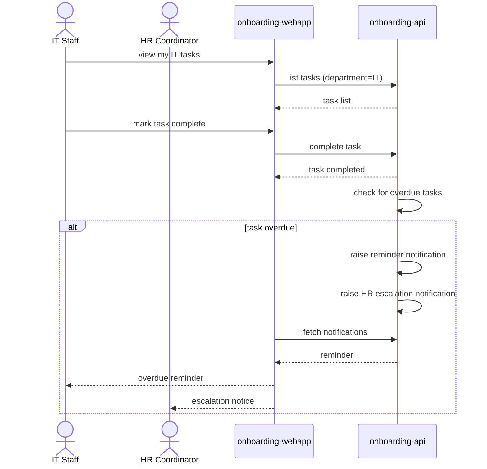

# Complete a task, and get reminded when overdue

IT/Facilities staff and the HR Coordinator work their own department's tasks;
the system reminds the owning staff member when a task passes its due date,
and escalates to the HR Coordinator when it is an IT or Facilities task.

